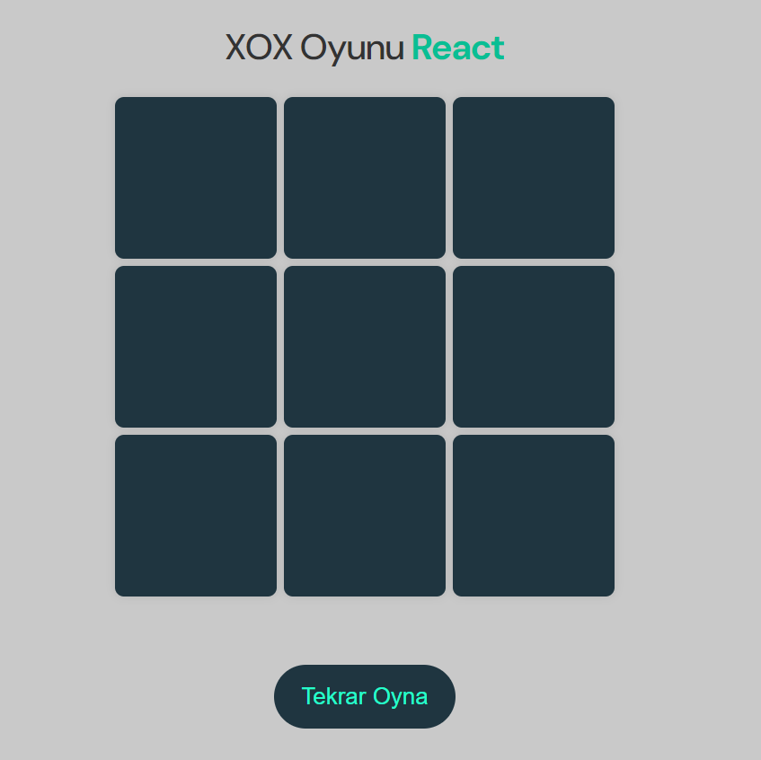

# XOX Oyunu (React)

React kullanılarak oluşturulmuş bir XOX oyunu. İki oyuncu arasında oynanan bu klasik masa oyununda, hedef X veya O sembollerini bir araya getirerek oyunu kazanmaktır.



# Nasıl Kullanılır

1. Proje dosyalarını bilgisayarınıza klonlayın veya indirin.
```bash
 git clone <proje-repo-url>
```

2. Proje klasörüne gidin.
```bash
cd xox-oyunu-react
```


3. Gerekli bağımlılıkları yükleyin.
```bash
npm install
```

4. Uygulamayı başlatın.
```bash
npm run dev
```

5. Tarayıcınızda aşağıdaki adresi ziyaret edin ve XOX oyununu oynamaya başlayın!
```bash
http://localhost:3000
```  

# Nasıl Oynanır
Oyunu başlattığınızda, varsayılan olarak "X" ile başlarsınız.
Sırayla X ve O hamleleri yapın.
Aynı sembolü yatay, dikey veya çapraz olarak üç kez bir araya getiren oyuncu oyunu kazanır.
Oyun sona erdiğinde veya bir oyuncu kazandığında, "Tekrar Oyna" düğmesini tıklayarak yeni bir oyun başlatabilirsiniz.

# Proje Yapısı
- src klasörü, React uygulamanızın kaynak kodunu içerir.
- Oyun tahtası, kullanıcıların hamlelerini yapabileceği kutucuklarla bölünmüştür.
- Oyunun sonucu belirlendiğinde bir kazanan ilan edilir veya oyun berabere biter.

# Tekrar Oyna
Oyun sona erdiğinde veya herhangi bir zamanda "Tekrar Oyna" düğmesini tıklayarak yeni bir oyun başlatabilirsiniz.